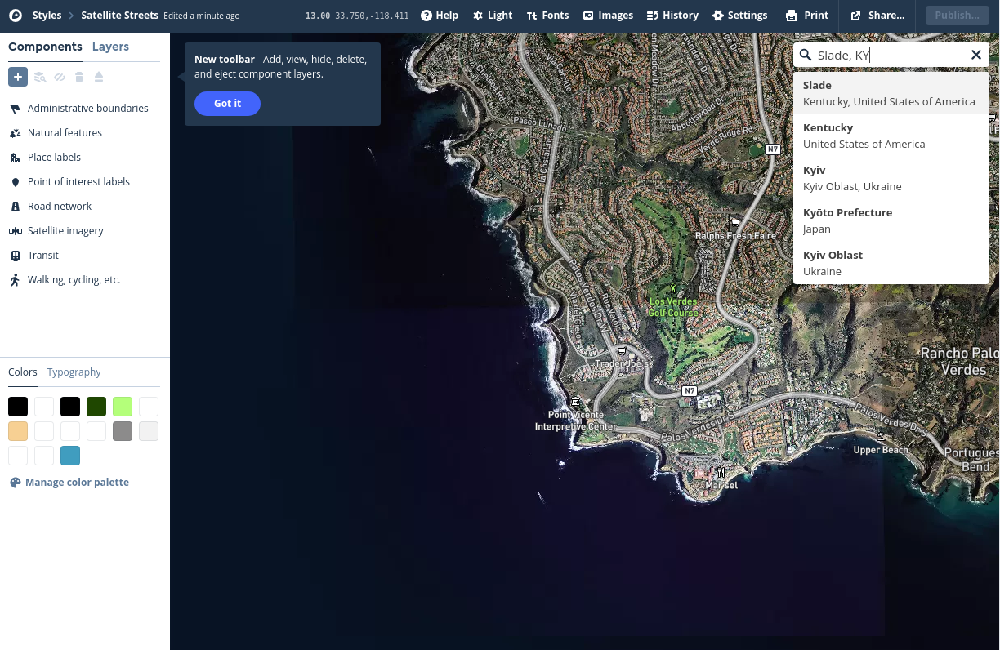
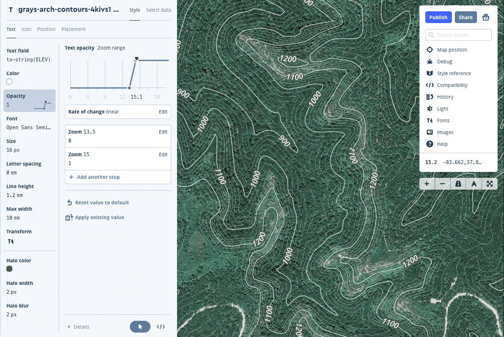

# Web mapping with GDAL and Mapbox

## Table of Contents

<!-- TOC -->

- [Web mapping with GDAL and Mapbox](#web-mapping-with-gdal-and-mapbox)
    - [Table of Contents](#table-of-contents)
    - [Overview](#overview)
    - [Data files](#data-files)
    - [Accessing and processing elevation data](#accessing-and-processing-elevation-data)
        - [Creating elevation contours with GDAL](#creating-elevation-contours-with-gdal)
            - [Clip Raster by Extent](#clip-raster-by-extent)
            - [Raster Calculator](#raster-calculator)
            - [Extract Elevation Contour Lines](#extract-elevation-contour-lines)
            - [Field Calculator](#field-calculator)
        - [Preparing data for upload to Mapbox](#preparing-data-for-upload-to-mapbox)
    - [The Mapbox platform](#the-mapbox-platform)
        - [Vector tiles](#vector-tiles)
        - [Create Mapbox account](#create-mapbox-account)
    - [Creating base map with Mapbox Studio](#creating-base-map-with-mapbox-studio)
        - [Definitions](#definitions)
        - [Add custom layers](#add-custom-layers)
            - [Add arches layer](#add-arches-layer)
            - [Add contour layer](#add-contour-layer)
        - [Create New Style](#create-new-style)
        - [Add and symbolize the contour layer](#add-and-symbolize-the-contour-layer)
        - [Adding text to index contour feature](#adding-text-to-index-contour-feature)
        - [Add arches layer](#add-arches-layer-1)
        - [Re-order layers](#re-order-layers)
    - [Publishing a map style](#publishing-a-map-style)
    - [Resources and references](#resources-and-references)
    - [Addendum I: Adding other tilesets to your map](#addendum-i-adding-other-tilesets-to-your-map)
    - [Addendum II: Geographic Names Information System](#addendum-ii-geographic-names-information-system)
        - [PostGIS processing technique](#postgis-processing-technique)

<!-- /TOC -->

## Overview

Raster tilesets have long powered web maps. In recent years, browser technology evolved to support interactive vector graphics very efficiently. This tech is called [WebGL (Web Graphics Library)](https://developer.mozilla.org/en-US/docs/Web/API/WebGL_API) and has revolutionized what we see in our browsers and how we interact with content. For example, you might notice that Google Maps is super smooth and fast when you pan and zoom. [Mapbox](https://www.mapbox.com/) offers a similar platform to build web maps using open source data.

We introduced GDAL in previous lessons to georeference non-spatial imagery, create raster tilesets, and for command line geoprocessing. In this lesson we will explore how to use it to extract elevation contours from national elevation imagery. Mapbox uses OpenStreetMap data, and while this is a tremendous resource, we might want to map other features. Being able to create data that can be hosted in Mapbox will be a handy skill.

In this lesson we will make a site map for Gray's Arch, a popular and scenic arch in the Red River Gorge Geological Area in Kentucky. A site map is a large-scale scene with elevation contours around the arch. When we zoom out, we'll fadeout the contours and show all 700+ arches in the United States.

The lab will parallel the lesson. You will be asked to make a site map for your favorite feature. We have a lot of features to use. For example, here are just the named arches and pillars.

    
Named arches and pillars

 An example Mapbox map and web page can be found [here](https://uky-gis.github.io/maps/us-arches/).

## Data files

* Point locations of U.S. named arches located here: [lesson-map/arches_us.geojson](lesson-map/arches_us.geojson). Locations are extracted from the National File on [Geographic Names Information System](https://www.usgs.gov/core-science-systems/ngp/board-on-geographic-names/download-gnis-data). See addendum for more information on this resource.
* Elevation data downloaded from the USGS NED 1/3 arc-second raster digital elevation model. This data can be accessed at the USGS 3D Elevation Program [usgs.gov](https://viewer.nationalmap.gov/basic/?basemap=b1&category=ned,nedsrc&title=3DEP%20View)
* Mapbox [style.json](https://uky-gis.github.io/maps/us-arches/style.json) developed in this lesson. Use it for a reference.

We need to execute a few processing steps before we add data to Mapbox. So, please work through this lesson before you start uploading data.

## Accessing and processing elevation data

Visit the [USGS website](https://viewer.nationalmap.gov/basic/?basemap=b1&category=ned,nedsrc&title=3DEP%20View) and search for "Slade, Kentucky". Select the *1/3 arc-second DEM* in the *Product Search Filter*. This Digital Elevation Model shows elevation with 10-meter resolution. This elevation model provides uniform elevation data for mapping applications in the United States. Higher resolution models are available for selected regions of the country.

    
Figure 1. Settings for downloading elevation data

Click on **Find Products** and then **results** for the *Elevation Products (3DEP)* category. Finally, click on the **Download** to get the data.

    
Figure 2. Download elevation data

Unzip the 434 MB file and put the contents in your downloaded data folder. **DO NOT add this to your local repository.** GitHub.com will block you from uploading this file.

### Creating elevation contours with GDAL

Add the raster data (*USGS_NED_13_n38w084_IMG.tif*) and arches.geojson to a new project in QGIS. Find and zoom to Gray's Arch.

    
Figure 3. Add layers and search for site to map

Do a query for `"feature_name" = 'Grays Arch'` in the *Select by Expression* builder:

    
Figure 4. Select by Expression

Zoom to the selected feature and fix your scale to 1:5,000. We will create contours for this extent around Gray's Arch. If contour too large of an area, we might not be able to upload the layer to Mapbox easily.

    
Figure 5. Define site at 1:5,000 scale centered on Grays Arch

The processing workflow will be as follows:

1. **Clip Raster by Extent** to site we defined at 1:5,000 scale.
2. **Raster Calculator** to convert elevation units from meters to feet.
3. **Contour** to make elevation contours with a 20-foot interval.
4. **Field Calculator** to make index contours for every 100 feet. An index contour has an attribute that allows us to symbolize it differently on the map.

#### Clip Raster by Extent

Find this tool in the QGIS menu **Raster > Extraction**.

    
Figure 6. Clip Raster by Extent tool parameters

For the *Clipping extent* press the button fly-out menu and select **Select extent on canvas**. Then draw the extent on the canvas. Click **Run** after you have successfully added an extent and specified an output TIFF file.

    
Figure 7. Drawing the extent on canvas

After removing the TIFF layer, you should see something similar

    
Figure 8. Elevation layer for site

#### Raster Calculator

Find this tool in the QGIS menu **Raster**. This powerful tool performs calculations on raster pixel values on a single layer and simultaneously on multiple layers. In our work, we'll perform a calculation on a single layer with the following expression, `"Clipped (extent)@1"  *  3.281`.

    
Figure 9. Raster Calculator setting

Now your range of elevation values might be more easily recognized.

#### Extract Elevation Contour Lines

Find this tool in the QGIS menu **Raster > Extraction**. Apply the following settings to create elevation contours every 20 feet of elevation change. You can create file in either a Shapefile or Geopackage format.

    
Figure 10. Contour settings

Open the attribute from the newly created vector layer.

    
Figure 11. Vector contour layer

#### Field Calculator

Let's finish our contouring exercise by adding an attribute that tells us if the contour value is an index value. We can use the [modulo operator](https://en.wikipedia.org/wiki/Modulo_operation) to see if the value is divisible by 100 without a remainder. This operator uses the `%` percent symbol and is used like a division operator, but returns 0 if there is no remainder. We need to make calculation that says, if value%100 = 0, then calculate the index value as 1, i.e., it is true, it not then make the index value 0.

In **Field Calculator** we will use the `if` conditional expression. The syntax is

`if( condition, return value if true, return value if false )`

So, for our exercise, the expression should be:

` if(  "ELEV" % 100 = 0, 1, 0)`

Create a new field called "index" and run the following calculation:

    
Figure 12. Add index contour value

After applying categorical symbology your contours could like similar to the below map.

    
Figure 13. Symbolized index contours

The final step is to export the contour layer as a Shapefile in EPSG: 4326 CRS. This might seem counterintuitive from previous lessons, but there is a good reason in this solitary case. The Shapefile format has a 400 vertex limit on a single line, so it will split those lines for us. Mapbox does have a line vertex limit that the Shapefile doesn't exceed. GeoJSON doesn't have this limitation so we can run into problems working with complex, large GeoJSON layers.

    
Figure 14. Creating contours in the Shapefile format

### Preparing data for upload to Mapbox

This concludes our raster analysis workflow. Let's prepare our arches and contour data for upload to Mapbox. A GeoJSON must be uploaded as a single uncompressed file.

The *arches_us.geojson* is ready to upload! No need to modify the file.

If you create a custom GeoJSON in QGIS, you'll need to remove a line of text in the .geojson file. QGIS adds a CRS definition in the second key of the JSON file. Seems a little  ridiculous, but Mapbox is expecting an EPSG: 4326 CRS, so this line is obsolete.  If the file takes forever to open in your text editor try using the [Sublime Text](https://www.sublimetext.com/3) editor, which can handle large files. Open remove one line of text:

`"crs": { "type": "name", "properties": { "name": "urn:ogc:def:crs:OGC:1.3:CRS84" } },`

    
Figure 15: Make sure you only change this one line!

The Shapefile needs to be bundled into a single .zip file. Select all of the members of the multi-file format and right-click to **Compress** (on MacOS) or **Send to > Compressed (zipped) Folder** (Windows OS)

    
Figure 16. Mac OS: Compress the multi-file Shapefile format to a single .ZIP file

    
Figure 17. Windows OS: Compress the multi-file Shapefile format to a single .ZIP file

You can add raster layers to Mapbox. Raster layers should be in the [Web Mercator CRS](https://en.wikipedia.org/wiki/Web_Mercator) (EPSG: 3857) and in the GeoTiff (.tif) file format. Be careful not to make the file size too large since Mapbox has account limits. If you're interested, explore the GDAL toolset and see if you can make a [Hillshade](http://www.geography.hunter.cuny.edu/~jochen/GTECH361/lectures/lecture11/concepts/Hillshade.htm) layer.


## The Mapbox platform

Probably the most well-known of Mapbox services is custom, beautiful map design. Using the very same OpenStreetMap data we used in previous modules, users can apply custom styles to global datasets, which are instantly rendered in vector tilesets. No more waiting to generate raster tilesets! (Their innovative [TileMill app](https://wiki.openstreetmap.org/wiki/TileMill) let cartographers build slippy maps with raster tilesets, but was discontinued in 2015.)

At the heart of Mapbox's advanced cartography is [Mapbox Studio](https://www.mapbox.com/mapbox-studio/), a browser editor that controls layer symbology and labeling based on attribute classification, zoom level, etc. It is similar to QGIS rule-based symbology, except you have hundreds of layers from OSM spanning the entire globe. You can add your own data too; raster or vector layers can be added to your mapping project. Studio has been called the "Photoshop of online maps."

Studio is one component in the [Mapbox ecosystem](https://www.mapbox.com/help/how-mapbox-works-overview/). When you have created cartographic masterpiece you must publish the tileset as a map [Style](https://www.mapbox.com/help/studio-manual-styles/), a text document that defines the look of your map layers. These styles are shared among the community of map makers on Mapbox and a curated set of designer styles is available to use.

To publish a web map we must customize an HTML document and use their JavaScript library, [Mapbox GL JS](https://www.mapbox.com/mapbox-gl-js/api/), to display our map. We will use this method to display a custom of our area of interest.

Have you ever used a map app on your mobile device? There's a good chance that the map was developed using Mapbox technology. If so, then you're helping Mapbox develop a real-time picture of how we travel and improve their base maps. Check our their [Telemetry Project](https://www.mapbox.com/telemetry/).

### Vector tiles

Supporting this revolution in web maps are vector tiles and WebGL, which is itself a product of [video gaming technology](https://en.wikipedia.org/wiki/OpenGL). Mapbox developed the [vector tile specification](https://www.mapbox.com/vector-tiles/specification/) in 2014 and made it an open standard. Expect to see more vector tiles in web maps and it's a good time to start learning about them.

If you recall from our GIS data model, the vector data model uses geometries (point, line and polygons) to encode real-world locations. Unlike raster data, vector data is highly compressible. When delivered over the internet to your browser, vector tiles are faster to load so your map loads faster.

A *vector tileset* assembles a large set of features into a structured format containing geometry and metadata (like feature attributes). When you request a map of an area, only those features within your browser window are loaded. Your browser does the heavy lifting of drawing the features, but computers have become so powerful that this is an easy task. Compared to raster tilesets, these tilesets don't have stepped zoom levels. This is really smooth.

### Create Mapbox account

Mapbox is [free](https://www.mapbox.com/pricing/) and you only pay if your map  becomes popular, i.e., a lot of map views are being requested. If you want private data, tilesets, and styles, or if you want to charge for use of your map, you will need a commercial license. No worries, we have all the tools we need with the free plan!

Create your account via this link: https://www.mapbox.com/signup/

Before you signup consider a good user name. You cannot change it. After your successful login, you should see:

   
Figure 018. Welcome to Mapbox!

How is it possible that we can access so much data for free? If you notice the [attribution requirement](https://www.mapbox.com/help/how-attribution-works/), we are using OpenStreetMap (in most cases). Mapbox's business model leverages open source data (and its contributors) to develop a service that would be nearly impossible otherwise. They then develop software, web infrastructure, and thorough documentation to support (much) larger applications. Another way to look at this free service is that it gives aspiring cartographers access to learn the Mapbox ecosystem.


## Creating base map with Mapbox Studio

Studio editor is the interface that we'll use to create our base map. Much like rule-based symbology in QGIS, we can change the appearance of our features by zoom level and attributes. Unlike QGIS, we don't need to render our tilesets; maps are rendered 'real-time' and can be deployed via an HTML document hosted on our GitHub Pages using their JavaScript library.

### Definitions

* **Dataset**: A dataset is an **editable** collection of GeoJSON features. Create, modify, and delete datasets in Mapbox Studio.

* **Tileset**: A tileset is a collection of raster or vector data broken up into a uniform grid of square tiles at 22 preset zoom levels. Mapbox has created a default set to start a project. Tilesets can used as layers in Styles. They cannot be edited.

* **Style**: We might traditionally call these *maps*. A style uses tilesets as layers, defines how features in these layers should appear (at different zoom levels),and are modified in the Style editor. Once you get the look you desire, a style can be published, downloaded, and shared. Mapbox provides a basic collection of style templates and a curated set of designer styles.

### Add custom layers

While the OSM data is pretty good, we have a couple issues for our scale of mapping. The OSM data Mapbox uses doesn't have as many arches and the contour interval is in meters.

Let's add two layers, aka tilesets, to Studio. We will adjust their appearance as we zoom into our area of interest.

* **Arches layer** added as a **dataset** in case we need to edit the layer.
* **Contour layer** added as a **tileset**.

#### Add arches layer

Open Mapbox Studio and select **Dataset**. Upload your *arches_us.geojson* and **Confirm**:

   
Figure 19. Upload new dataset

After a successful upload, you should find the Dataset editor. This will allow you change the location of features, add/delete features, and alter attributes. After you visit your location, you can add interesting discoveries to this dataset.

   
Figure 20. Dataset editor

After you finish editing the dataset, you will need to convert to a tileset in order to use it in a style. Click on **Tilesets** and find **New Tileset** button. Click on that and select **Create from dataset**:

   
Figure 21. Add new tileset from dataset

After the conversion, verify that you can see the new tileset listed and available for use in a style.

#### Add contour layer

Since datasets cannot be over 5 MB when they're hosted in Studio, we need to upload larger datasets directly as tilesets. If we need to edit larger files, then we need to do it locally and simply replace the old tileset. Create a **New tileset** and upload your *grays-arch-contours.zip*:

   
Figure 22. Add new tileset from upload

You will be presented with the option to *Export to a new tileset* or *Update a connected tileset*. Since this is your first time creating this tileset from the arches_us dataset, be sure to select *Export to a new tileset*. 

Again, verify that you have a new tileset (might take awhile to process).

### Create New Style

After you have some custom tilesets, you can now add them to a new map, aka **Style**. Click on the **New Style** and select **Pick a template or upload a style**. You can select any style, but **Satellite Streets** and **Outdoors** are good choices for our theme. Each lists the template tileset that are used.

   
Figure 23. Add New Style from template

If you want to get a copy of our lesson style (and skip learning how to apply layer settings from scratch) you can upload the [style.json](https://uky-gis.github.io/maps/us-arches/style.json) for our lesson. This option will show the settings used on [this map](https://uky-gis.github.io/maps/us-arches/full/) for each layers.

After a style is selected, the Studio editor will launch. On the left side you have layers. The right side has a command menu that tells you current zoom level, map position, etc. Search for your location:

   
Figure 24. Use search bar to jump to your area of interest

Center your area of interest in your map view using the pan and zoom. When you have it centered, let's unlock the **Default Position** in the **Map Position** properties:

   
Figure 25. Fix your default map position

Your map is now centered on your area of interest. No need to click **save** anywhere since it's always saved. Change the name of your style to represent your area of interest. In the upper-left corner you'll see the template name, click it and replace it.


### Add and symbolize the contour layer

While Mapbox has a contour layer in a Terrain tileset, the detail was not as good as what could be made with our GDAL workflow. In addition, it was difficult to convert from metric units. Mapbox is becoming much more sophisticated, but it's good to learn how make custom contours.

Click **+** button (e.g. Add new layer) and select the source you uploaded.

   
Figure 26. Add contours

Select the **Color** properties tab and make the contours white with an opacity of 70.

   
Figure 27. Changing color of contours

Now let's make them disappear when we zoom out. Notice the command palate tells the current zoom level. At zoom level 14, we want to make the zoom opacity property to be 1. At 13.5 we want to make the opacity 0. Click **Opacity tab > Style across zoom range** and change the zoom levels and opacity settings.

   
Figure 28. Style across zoom range

The goal is make the contours disappear before we see the edges of our site map. This helps the user stay focused at high zoom level in the presented site.

   
Figure 29. Keep user at high zoom level in presented site

Depending on the range of your contour values, you'll might need to add an index contour, a thicker line at a regular interval. First, edit the line symbol for all contours. Make them transparent, very thin, and appear at high zoom levels. This should very similar to QGIS Style properties for a layer.

Let's symbolize the index contours and alter the **Width** property using the **Style with data conditions**. Select the **index** field and assign higher widths for index contours.

   
Figure 30. Symbolize index contours

### Adding text to index contour feature

Duplicate the contour layer and use **Select Data** to change layer **Type** to **Symbol**. This access the labeling engine in Mapbox.

   
Figure 31. Add symbol layer to access labeling

Once the layer is added, you need to add the **Text field** property, change the text size, color, etc. and add some **Halo** effects to help read the text. Next, click on the **Placement** tab and change the **Placement** property to label on the line. Studio will try to find the best location in your view to drop the label.

To label the index contour, select the **Select data > Filter** tab and add a filter to select only those contours you want to label

   
Figure 32. Label only index contours by using Select data > Filter

As you label your features, consider having them appear at very high zoom levels. This will help reduce clutter and make it easier to read.

   
Figure 33. Make labels disappear at zoom level 13.5

### Add arches layer

Similar to the steps we just completed for adding contours and its label, adding points can be different if we want to add custom icons with labels. Select **arches_us** and change the **Type** to **Symbol**.

   
Figure 34. Add symbol layer for custom icons

Let's now add a custom SVG icon for arches. Use the icon found in [*lesson-map/arches.svg*](lesson-map/arches.svg). Then, upload it to the **Command palette > Images** section.

   
Figure 35. Add custom icons

Style the text color and halo properties and add text offset to move the text off the label.

   
Figure 36. Style custom icon labels and text

Wondering how the color values were selected to match the icon? The SVG format (Scaled Vector Graphics) is a text-based format that we can open in our editor. When we peek into the arches SVG file, we can find the exact colors used.

   
Figure 37. Inspect SVG for colors

The hexadecimal value for the light color is `#E2D7D1` and for the darker color `#7E4300`.

### Re-order layers

Note that you can re-order the tileset layers in style from within Studio by dragging them in the layer panel just like in QGIS. Make sure your arches tileset is above your contours tileset. Both should be above the `satellite` tileset.

## Publishing a map style

When you're ready to finish your map or make a new instance of this style, you **Publish style**. First, let's reset our map's initial zoom level and center. Unlock and lock will reset the settings.

   
Figure 38. Reset map center and zoom level

Click on **Publish** and then **Publish** again for new maps.

   
Figure 39. Publish style


Next, we need to get the **Style URL** and **Access token** to use this map on a web page. In Studio click on the **Share** on the command palette and select **Use** tab:

   
Figure 40. Share, develop & use

Create an HTML document, insert the copied text, and change the parameters highlighted in the comment tags.

```html
<!DOCTYPE html>
<html>
<head>
  <meta charset='utf-8' />
  <title>Display a map</title> <!--Change this!! -->
  <meta name='viewport' content='initial-scale=1,maximum-scale=1,user-scalable=no' />
  <script src='https://api.tiles.mapbox.com/mapbox-gl-js/v0.49.0/mapbox-gl.js'></script>
  <link href='https://api.tiles.mapbox.com/mapbox-gl-js/v0.49.0/mapbox-gl.css' rel='stylesheet' />
  <style>
    body { margin:0; padding:0; }
    #map { position:absolute; top:0; bottom:0; width:100%; }
  </style>
</head>
<body>

<div id='map'></div>

  <script>
    // Change this to your Token ----------------------
    mapboxgl.accessToken = 'pk....';
    // ------------------------------------------------

    var map = new mapboxgl.Map({
      container: 'map',

      // Change this to your style --------------------
      style: 'mapbox://styles/...',
      // ----------------------------------------------

      // Change to your location ----------------------
      zoom: 15.65,
      center: [-83.657662, 37.817418]
      // ----------------------------------------------

    });

    // Add geolocate control to the map.
     map.addControl(new mapboxgl.GeolocateControl({
      positionOptions: {
        enableHighAccuracy: true
      },
      trackUserLocation: true
    }));
  </script>

</body>

</html>
```

Upload this as "map.html" to the *lesson-map* folder in your repo. Modify the *index.html* file with appropriate content, if desired.

## Resources and references

* [About 3DEP Products & Services](https://www.usgs.gov/core-science-systems/ngp/3dep/about-3dep-products-services)
* [Mapbox Studio manual](https://www.mapbox.com/studio-manual/overview/)
* [Mapbox base maps](https://www.mapbox.com/maps/)

## Addendum I: Adding other tilesets to your map

Let's say you wanted to added terrain data or state outlines to your map. You **Add Layer** as normal and pick one the global tilesets that Mapbox has created. Let's add the *Terrain (RGB-encoded dem)* from our *Unused sources*.

   
Figure 41. Add Terrain tileset

Reorder the layers by moving the mapbox-errain layer to just above the satellite layer.

   
Figure 42. Add Terrain tileset

Finally, adjust the *Intensity* values and *Style across zoom range* to fade the layer out when we zoom into the site.

   
Figure 43. Style across zoom range settings


## Addendum II: Geographic Names Information System

This exercise uses the national file dataset from the United States Board of Geographic Names [website](https://www.usgs.gov/core-science-systems/ngp/board-on-geographic-names/download-gnis-data). It is often called the *GNIS*, Geographic Names Information System because the features have location, type, elevation, and the proper nouns found US topographic maps. Interestingly, not all of these features are also found in the OpenStreetMap dataset.

Below is a table that shows the type of features found in the national dataset, the total count, and average elevation.

|Feature Class|count|avg elev in ft|id|
|:-----------|:------:|------:|------:|
|Airport|23518|1190|1|
|Arch|720|3947|2|
|Area|2577|2500|3|
|Arroyo|465|4602|4|
|Bar|5874|278|5|
|Basin|4299|4678|6|
|Bay|14041|228|7|
|Beach|2413|240|8|
|Bench|727|4544|9|
|Bend|2790|1028|10|
|Bridge|7357|838|11|
|Building|160299|920|12|
|Canal|21571|2356|13|
|Cape|16415|129|14|
|Cemetery|147106|944|15|
|Census|11641|1306|16|
|Channel|4006|-94|17|
|Church|231968|762|18|
|Civil|64243|1178|19|
|Cliff|4476|2751|20|
|Crater|246|4870|21|
|Crossing|13164|788|22|
|Dam|56915|1573|23|
|Falls|2531|2428|24|
|Flat|10470|4818|25|
|Forest|1313|2141|26|
|Gap|8260|4023|27|
|Glacier|1020|5439|28|
|Gut|3529|-99|29|
|Harbor|1271|191|30|
|Hospital|15863|1021|31|
|Island|20548|59|32|
|Isthmus|28|134|33|
|Lake|69600|2087|34|
|Lava|168|4336|35|
|Levee|545|390|36|
|Locale|162629|1935|37|
|Military|2860|821|38|
|Mine|36133|5585|39|
|Oilfield|4863|1128|40|
|Park|69520|944|41|
|Pillar|2099|3868|42|
|Plain|289|4113|43|
|Populated Place|200933|1000|44|
|Post Office|69692|1287|45|
|Range|2487|4472|46|
|Rapids|1068|1419|47|
|Reserve|1276|3497|48|
|Reservoir|73284|2719|49|
|Ridge|15124|3353|50|
|School|216474|909|51|
|Sea|30|0|52|
|Slope|383|2718|53|
|Spring|38678|4649|54|
|Stream|231629|1595|55|
|Summit|70621|3904|56|
|Swamp|7645|654|57|
|Tower|16801|1345|58|
|Trail|11047|4033|59|
|Tunnel|750|3075|60|
|Unknown|186|467|61|
|Valley|70047|3321|62|
|Well|38796|3903|63|
|Woods|684|1699|64|

### PostGIS processing technique

Let's say you load the national file into your database and want to perform similar summary statistics as shown in the above table. Maybe you want to extract a feature class from the dataset that meets a set of criteria, e.g., elevation, region, within distance of another location, etc. The techniques we have learned in prior lessons can be fully utilized to make custom data to drop into MapBox.

To use the below query, you need to download the national file or state file of your choice, upzip, drop into QGIS, and import into PostGIS. This assumes the table is called "gnis_201808" and the field names have been converted to lowercase names.

```sql

-------- Summary stats on the National GNIS file --------

/*
Create a temporary table called "elevations" that has
a id field, converts the elevation field to a numeric type,
and removes the fields without elevation.
The query will throw an error if it trys to due stats on empty
fields. On import, the elevation field is varchar type.
*/

with
  elevations
as (
  select
    id as id2,
    (elev_in_ft)::numeric as elev
  from
    gnis_201808
  where elev_in_ft <> ''
   )

/*
Perform the average statistic and then join the table
back to the original table.
*/

select
  feature_class,
  round(avg(elevations.elev), 1) as avg_elevation,
  count(*) as count
from
  gnis_201808
left join
  elevations
on
  elevations.id2 = gnis_201808.id
group by
  feature_class
order by
  feature_class
```
